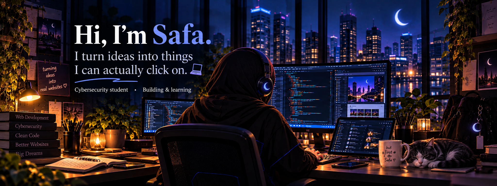
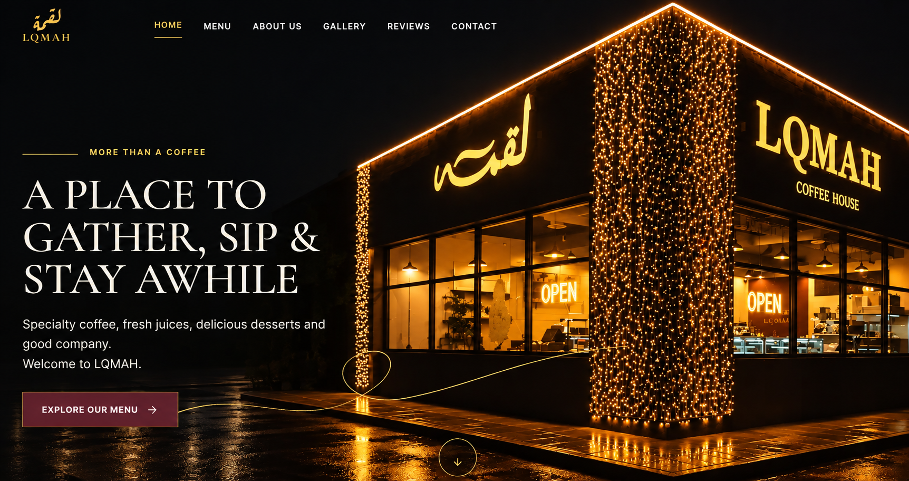
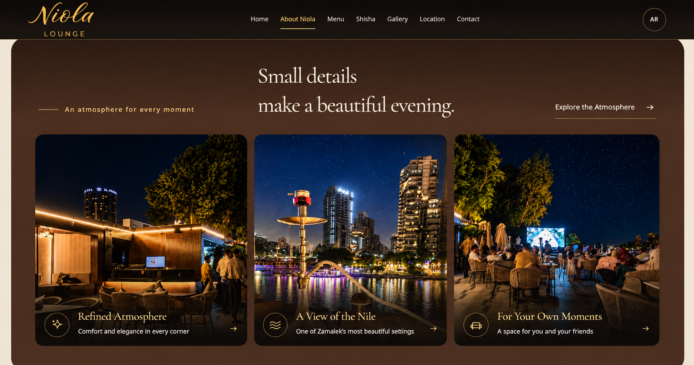
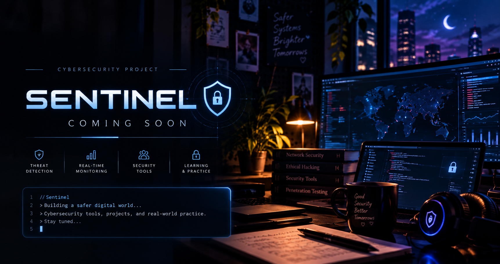
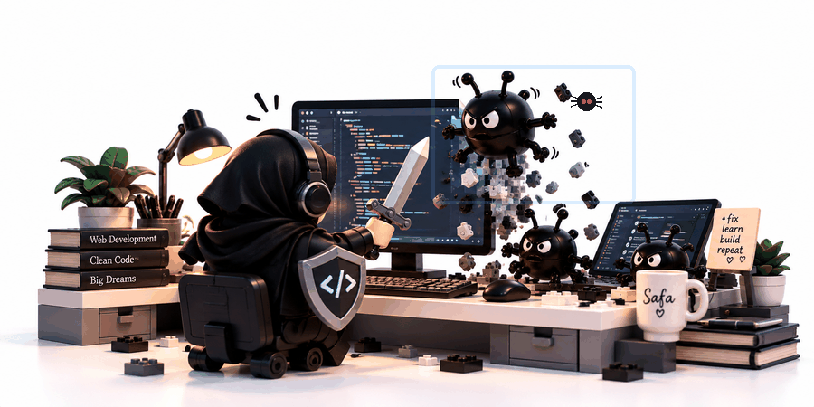

  

 

---

## ✦ Featured Projects

A few real-world projects I've designed and developed — plus what I'm planning next.

<table>
<tr>

<td width="33%" valign="top">
  

  <h3>01 — LQMAH Café ☕</h3>

  
Full-stack client project with a custom CMS and admin dashboard.

  
<strong>Next.js · React · TypeScript · Supabase</strong>

  <a href="https://lqmah-cafe.vercel.app">Live Site</a> ·
  <a href="https://github.com/s-qasem/LQMAH">Repository</a>
</td>

<td width="33%" valign="top">
  

  <h3>02 — Niola Lounge ✦</h3>

  
Responsive client website with a custom content-management experience.

  
<strong>React · JavaScript · Vite</strong>

  <a href="https://niola-lounge.vercel.app">Live Site</a> ·
  <a href="https://github.com/s-qasem/niola-lounge">Repository</a>
</td>

<td width="33%" valign="top">
  

  <h3>03 — Sentinel 🛡️</h3>

  
Planned cybersecurity project for exploring security tools, monitoring, and hands-on defense.

  
<strong>Cybersecurity · Security Labs · Monitoring</strong>

  <code>Coming Soon</code>
</td>

</tr>
</table>

---

## ✦ Technologies I Use

  
  
  
  
  
  
  
  
  
  
  
  
  

---

## ✦ Currently Learning & Exploring

  
  
  
  
  

## ✦ About Me

Building things. Breaking things. Learning why. 💻

50% curiosity. 50% “let me try something.”  
Professional tab opener. Occasional tab closer.

**Ctrl+Z is part of the process.**

  

  <i>Probably debugging something I just “fixed.” 🐛</i>

